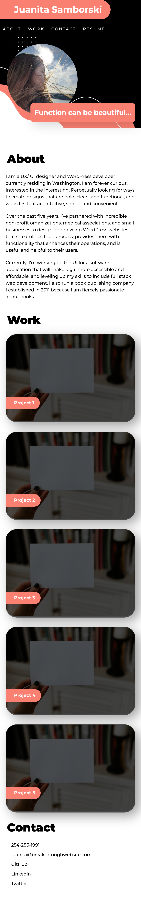

# Portfolio
Learn a bit more about me and the work I've accomplished.

## Overview

This one-page website provides potential employers with a list of projects worked on so that they may evaluate if the skills displayed in each portfolio item meets their requirements for a position within their company.

## The Project

The one-page site was built with HTML and CSS. The menu contains links that directs users directly to the associated section on the page. The hero includes a profile image. Following this section, the potential employer will be provided with information about the candidate, portfolio items, and a list of ways to connect with the candidate. 

## Getting to Work

Applied proper indentations, included semantic elements, added descriptions to images (where applicable), and commented on both the HTML and CSS files, describing each section, making the code easier to read. 

The header navigation moves the User to the associated section when the menu item is clicked. When the User hovers over menu items, there is a distinct animation allowing the User to easily see which item they are hovering over. The header section is fixed so that the User can easily move throughout the page, clicking on menu items that correspond with the section they are interested in reviewing. 

Section titles are clearly defined on the left side of the page, with the right side containing the content. Flexbox was used to create the columns and keep the layout consistent throughout. 

Flexbox properties were also applied to the portfolio items, with customization to ensure that the first item, the featured project, extended 100%, with subsequent projects appearing two in a row, and dropping down to one per row when in mobile view. 

Links in the contact section are clickable. When the phone number is clicked, it initiates a call. Clicking on the email address will open up an email window. Other links direct the User to the associated pages. 

Media queries were added to ensure mobile responsiveness. 

## Take a Look

GitHub Repository: https://github.com/jsamborski310/my-portfolio

GitHub Pages: https://jsamborski310.github.io/my-portfolio/

## The Preview

Desktop View

Mobile View

